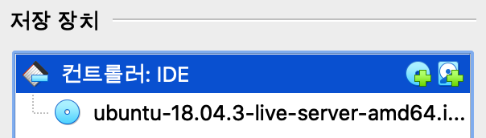
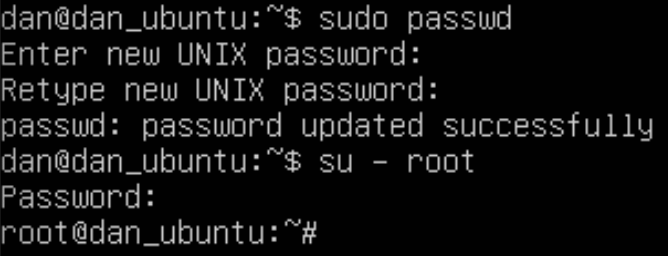
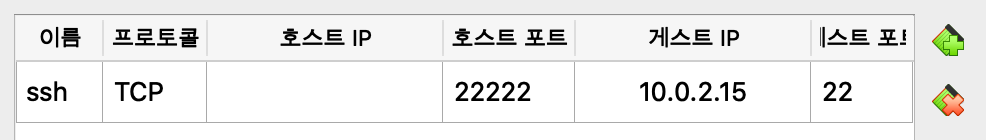
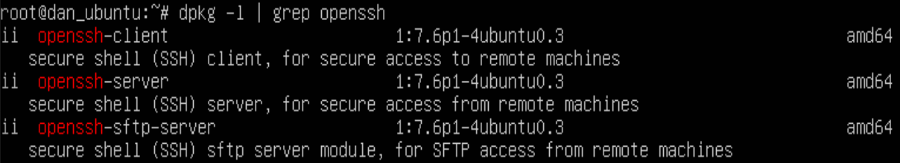

# Setup

## Ubuntu 설치하기

> Virtual Box 6.1  
> Ubuntu 18.04.4 LTS (Bionic Beaver) 64 Bit

- Install Image Mount 후 실행시 자동으로 설치됩니다.


- remote 에서 root 비밀번호 설정  


## ssh 접속하기

1. 포트 포워딩 설정
   - 설정 - 네트워크 - 어댑터1 - 고급 - 포트 포워딩
   

2. local 에서 netstat 명령어로 22222 port 의 listen 확인

```shell script
choibyunghyeon  ~/VirtualBox VMs
 netstat -an | grep 22222
tcp4       0      0  *.22222                *.*                    LISTEN
```

1. remote 에 ssh 설치 (이미 설치했다면 생략 가능)
   1. openssh 설치 여부 확인
      - `dpkg -l | grep openssh`

   2. openssh 설치

```shell script
sudo apt-get update
sudo apt-get install openssh-server
```

   3. openssh 설치 확인
        

   4. local 에서 ssh 접속하기

```shell script
 ssh dan@localhost -p 22222
dan@localhost's password:
Welcome to Ubuntu 18.04.3 LTS (GNU/Linux 4.15.0-91-generic x86_64)
...
dan@dan_ubuntu:~$
```