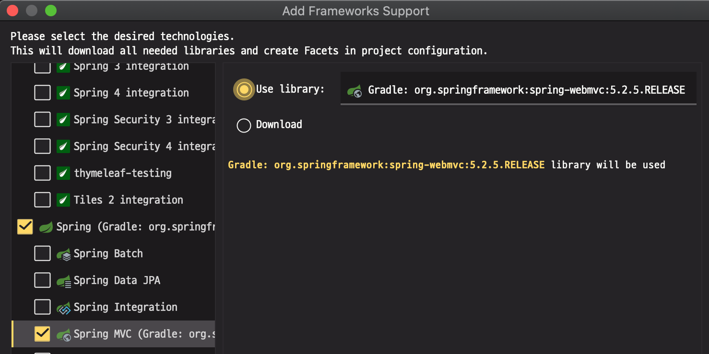

# Web Server

## Spring Boot - Apachi Tomcat 연동

### Local Server Setting

#### # install tomcat@8

```shell script
> brew update
> brew install tomcat@8

# list 명령어로 설치 확인
> brew list

# 기본 설치 경로
> pwd
/usr/local/Cellar
> ls -lrt
drwxr-xr-x  3 choibyunghyeon  admin  96  4  1 20:41 tomcat@8
```

#### # Spring MVC Add



#### # Tomcat Setting (IntelliJ)

##### web/WEB-INF/web.xml

```xml
<servlet-mapping>
    <servlet-name>dispatcher</servlet-name>
    <url-pattern>/</url-pattern>
</servlet-mapping>
```

##### web/WEB-INF/dispatcher-servlet.xml

```xml
<?xml version="1.0" encoding="UTF-8"?>
<beans xmlns="http://www.springframework.org/schema/beans"
       xmlns:xsi="http://www.w3.org/2001/XMLSchema-instance"
       xsi:schemaLocation="http://www.springframework.org/schema/beans http://www.springframework.org/schema/beans/spring-beans.xsd">

    <!-- Annotation 활성화 -->
    <mvc:annotation-driven/>
    <!-- Component 패키지 지정 -->
    <context:component-scan base-package="com.example.dust.controller"/>

    <!-- 여기서 설정한 내용으로 view object의 이름이 결정된다. -->
    <bean class="org.springframework.web.servlet.view.InternalResourceViewResolver">
        <property name="prefix" value="/WEB-INF/view/"/>
        <property name="suffix" value=".jsp"/>
    </bean>
</beans>
```

##### Tomcat 위치 설정

> Run > Run/Debug Configurations  

```shell script
# Server > Application Server > Tomcat Home
/usr/local/Cellar/tomcat@8/8.5.53/libexec

# Server > Tomcat Server Setting
HTTP Port : 80

# Deployment
## war 추가 후 Application Context / 로 변경
```

## 참고 자료

<https://gmlwjd9405.github.io/2018/10/25/intellij-springmvc-tomcat-setting.html>