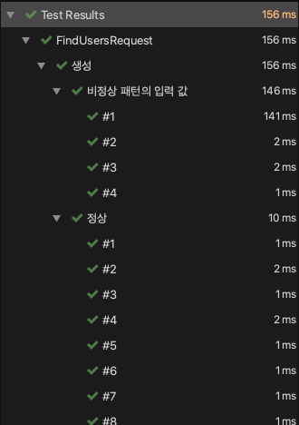

> 처음 ParameterizedTest 를 본건 코드스쿼드 멤버의 코드를 리뷰하면서 였습니다. `@CsvSource` 의 단순한 형태였던 것으로 기억하는데, 당시에는 러닝 커브의 이유로 공부하지 않았었습니다.  
> 하지만 이제는 회사에서의 개발을 시작하면서, 몇 가지 시도를 해봤고 조금은 마음에 드는 코드가 나와 글을 써 봅니다.  
> (라고 하지만 이 글을 쓰는 순간에도 설정 에러가 나고 있습니다 🤣)  
> 
> 영감을 준 Sunny 에게 감사를.

ParameterizedTest 에 대한 설명은 더 좋은 자료들이 많으니 Annotaion 만 정리하고 넘어가겠습니다.

| Annotaion         | Description                                 |
| ----------------- | ------------------------------------------- |
| `@ValueSource`    | literal 배열 값으로 테스트                  |
| `@EnumSource`     | Enum 값으로 테스트                          |
| `@MethodSource`   | 가공이 필요한 복잡한 형태의 값으로 테스트   |
| `@CsvSource`      | 쉼표로 구분 된 값으로 테스트                |
| `@CsvFileSource`  | `@CsvSource` 형태의 파일로 값을 받아 테스트 |
| `@ArgumentSource` | ArgumentProvider 를 받아서 테스트           |

---

## Code

ParameterizedTest 을 선택한 이유는 가독성과 재사용성입니다. 그 중에서도 제가 의도한 방식인 `@ArgumentSource` 을 핵심 부분만 축약한 코드를 첨부합니다.

### FindUsersRequest

> Client 로 부터 전달받는 User 정보 객체

```java
public class FindUsersRequest {

  ...

  @Pattern(regexp = ValidateUtil.EmailRegExp)
  @Schema(description = "이메일")
  private String email;

  @Pattern(regexp = ValidateUtil.PhoneRegExpOnlyNumber)
  @Schema(description = "전화번호")
  private String phoneNumber;
}
```

### NormalFindUsersRequestProvider

> 정상 User 정보를 가진 FindUsersRequest 테스트 데이터 Provider

```java
public class NormalFindUsersRequestProvider implements ArgumentsProvider {

  private final List<FindUsersRequest> normalFindUsersRequests = Arrays.asList(
      FindUsersRequest.builder()
          .email("choi@gmail.com").build()
      , FindUsersRequest.builder()
          .phoneNumber("01044445555").build()
  );

  @Override
  public Stream<Arguments> provideArguments(ExtensionContext context) {
    return normalFindUsersRequests.stream().map(Arguments::of);
  }
}
```

### WrongFindUsersRequestProvider

> 비정상 User 정보를 가진 FindUsersRequest 테스트 데이터 Provider

```java
public class WrongFindUsersRequestProvider implements ArgumentsProvider {

  private final List<FindUsersRequest> wrongEmailFindUsersRequests = Arrays.asList(
      FindUsersRequest.builder()
          .email("choigmail.com").build()
      , FindUsersRequest.builder()
          .phoneNumber("010#24592711").build()
  );

  @Override
  public Stream<Arguments> provideArguments(ExtensionContext context) {
    return wrongEmailFindUsersRequests.stream().map(Arguments::of);
  }
}
```

### FindUsersRequestTest

> FindUsersRequest 를 검증

```java
public class FindUsersRequestTest {

  private static Validator validator;
  ...

  @DisplayName("정상")
  // 테스트 케이스마다 반복적으로 주석을 달아줍니다.
  @ParameterizedTest(name = "#{index}")
  @ArgumentsSource(NormalFindUsersRequestProvider.class)
  // NormalFindUsersRequestProvider 에 정의된 FindUsersRequest 테스트 값을 가져옵니다.
  public void normalFindUsersRequest(FindUsersRequest findUsersRequest) {
    // FindUsersRequest 을 검증합니다.
    Set<ConstraintViolation<FindUsersRequest>> constraintViolations
        = validator.validate(findUsersRequest);
    assertEquals(0, constraintViolations.size());
  }

  @DisplayName("비정상 패턴의 입력 값")
  @ParameterizedTest(name = "#{index}")
  @ArgumentsSource(WrongFindUsersRequestProvider.class)
  public void wrongFindUsersRequest(FindUsersRequest findUsersRequest) {
    ...
  }
}
```

### 테스트 결과



## 좋은 점

- Provider 를 사용하여 테스트 케이스와 테스트 코드를 분리할 수 있습니다.
  - 나아가 Json 형태로 Import, Export 가 가능해 관리가 편해집니다.
- ParameterizedTest 의 주석 기능으로 테스트 결과 해석이 더 쉬워집니다.

---

> Reference

[https://javabydeveloper.com/junit-5-parameterized-tests-with-examples/](https://javabydeveloper.com/junit-5-parameterized-tests-with-examples/)
