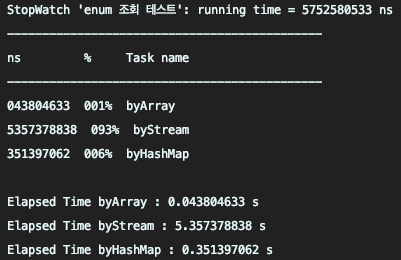
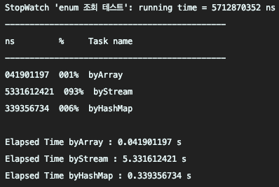

회사의 value 를 통한 enum 조회 코드를 보다가 불현듯 이펙티브 자바와 블로그에서 본 개선 방법이 생각나서 실험을 해봤습니다.

> EnumMap 을 사용할 수 있을까?

이펙티브 자바에 있는 내용이 생각나 확인해 봤지만, EnumMap 은 Key 값으로 enum 을 사용하는 것이라 이 경우에는 적용할 수 없었습니다.

# Value 를 통한 검색에서 Stream, Array, Map 의 퍼포먼스 차이는 어떻게 될까?

```java
public enum CategoryColor {

  YELLOW(0, "#FEDE00"),
  BLUE(1, "#85C4E7"),
  ORANGE(2, "#F3AC13"),
  ...;

  private final int order;
  private final String code;

  public static final Map<Integer, CategoryColor> categoryColorMap = new HashMap<>();

  static {
    for (CategoryColor color : CategoryColor.values()) {
      categoryColorMap.put(color.getOrder(), color);
    }
  }

  public static String getColorByHashMap(int order) {
    return categoryColorMap.get(order).code;
  }

  public static String getColorByArray(int order) {
    return CategoryColor.values()[order].code;
  }

  public static String getColorByStream(int order) {
    return Arrays.stream(CategoryColor.values())
        .filter(categoryColor -> categoryColor.order == order)
        .findAny()
        .map(CategoryColor::getCode)
        .orElse(CategoryColor.YELLOW.code);
  }
}
```

```java
@Test
void byStream() {
  stopWatch.start("byStream");
  IntStream.range(0, 100000000).forEach(order -> CategoryColor.getColorByStream(1));
  stopWatch.stop();
}

@Test
void byArray() {
  stopWatch.start("byArray");
  IntStream.range(0, 100000000).forEach(order -> CategoryColor.getColorByArray(1));
  stopWatch.stop();
}

@Test
void byHashMap() {
  stopWatch.start("byHashMap");
  IntStream.range(0, 100000000).forEach(order -> CategoryColor.getColorByHashMap(1));
  stopWatch.stop();
}
```
 

1억건을 기준으로 테스트한 결과, 예상과는 조금 다른 결과가 나왔습니다.  
아이디어를 얻었던 블로그에서는 HashMap 검색이 압도적으로 빨랐지만, 테스트 결과는 오히려 반대였습니다.  
비지니스 로직을 적용해도 2배가 채 차이나지 않아서 기대한만큼 높은 성능 개선이 아니었습니다.

# 후기

그래도 Array 형태로 조회하던 기존의 코드보다는 속도가 빠르니까 적용하려고 했습니다.  
하지만 회사에서의 코딩은 협업을 우선으로 합의된 스타일을 사용해야 된다는 생각이 들어 동료와 얘기해본 결과 기존의 방식을 유지하기로 했습니다.

```
HashMap 을 이용한 조회를 위해서는 코드량이 늘어나고, 다른 동료들이 익숙하지 않은 스타일입니다.
기존의 방식을 수정해야될 정도로 높은 성능 개선 효과가 없습니다.
```

리팩토링을 위해 더 좋은 방법은 앞으로도 나오겠지만, 적용하기 위한 소모값도 고려해야 된다는 생각을 했습니다.  
그리고 실 적용전 기대 수준의 성능 개선이 되는지도 검증해봐야 된다는 것을 다시 한번 느꼈습니다.

언젠가는 Stream 도 저만큼 빨라지기를!

> 환경

- Spring boot 2.x.x, java 11  
- 테스트 코드 Repository [Link](https://github.com/Hyune-c/PerformanceTest/blob/master/src/test/java/com/example/performance/code/CategoryColorTest.java)
