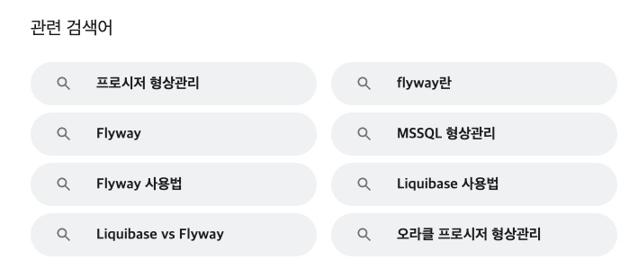
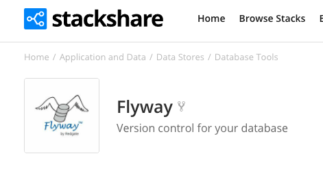
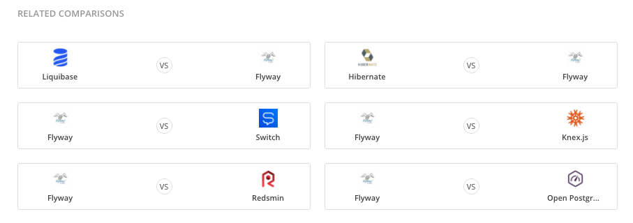
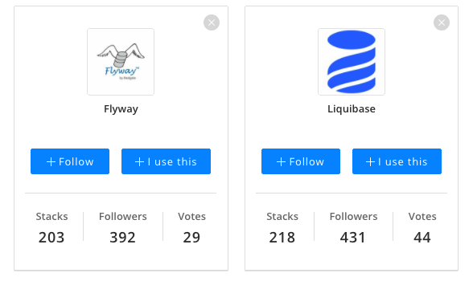
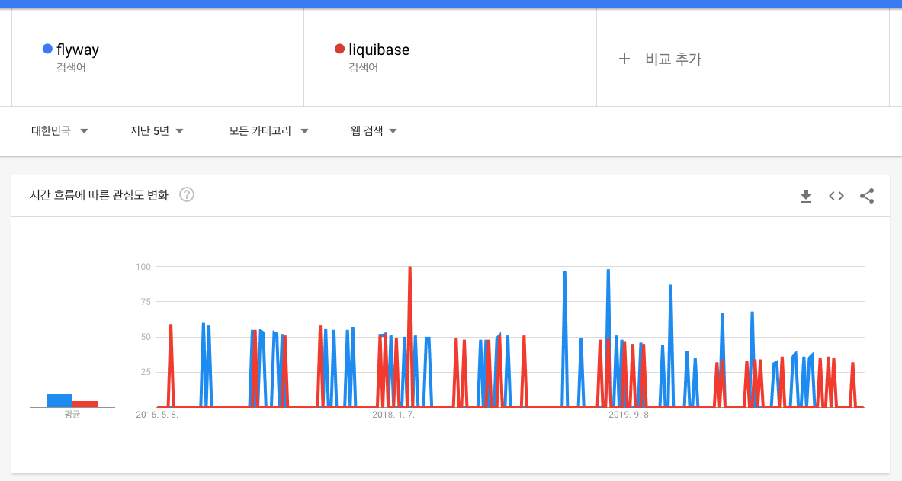
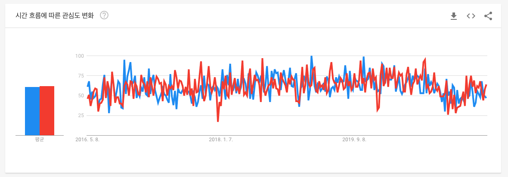
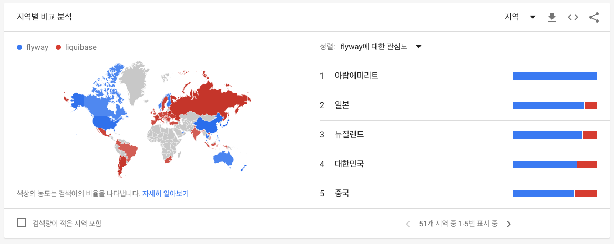
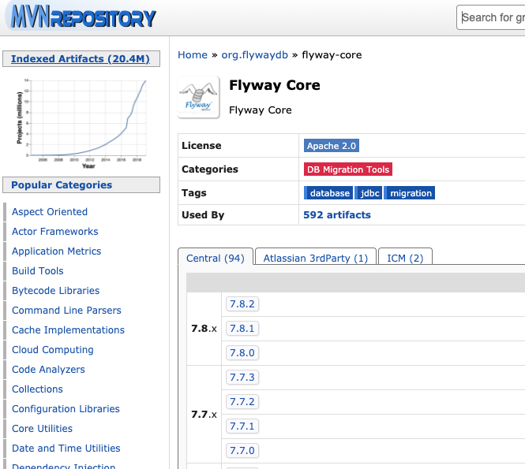
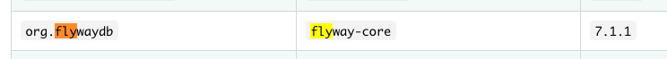
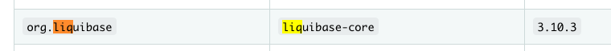

최근 회사에 DB 형상 관리 라이브러리를 새로 적용할 일이 생겼습니다.  
익숙한 것은 flyway 였지만 요즘은 오픈소스가 워낙에 많고, 내가 모르는 더 좋은 라이브러리가 있지 않을까? 하는 생각에 찾아보기 시작했고, 그 과정이 생각보다 재미있었기에 글을 작성해봅니다.

> 결론부터 말하자면 flyway 를 선택했습니다.  
> 이하에서는 라이브러리 대신 기술이라는 단어를 사용합니다.

기술을 검색하기 시작했을 때 제 머리 속에 있던 키워드는 형상관리, flyway 단 2개 였습니다.

## 1. 구글 검색하기

개발의 알파이자 오메가 구글 검색 입니다.  
1 페이지에 모두 같은 기술로 도배되어있기에 사실상 여기에서 flyway 를 선택하고 끝내도 이상하지 않습니다.

하지만 관련 검색어를 보면 다른 키워드도 보입니다.  
조금 더 검색해봅시다.

## 2. stackshare

요즘 뜨는 기술 소개 (?) 사이트 입니다.  
기술들이 카테고리 별로 구분되고, 연관된 기술들을 비교해줘서 내가 모르던 키워드를 인지하는데 좋습니다.

여기에서도 Liquibase 가 보이네요.

Stack 수도 거의 비슷한 것을 보면, 어쩌면 내가 알지 못하던 liquibase 가 더 뜨고 있고 배워야할 기술일 수도 있겠네요.

## 3. Google Trands

다시 구글입니다.  
5년 추세를 볼 때 flyway 가 7:3 정도로 우세함을 알 수 있습니다.  
(솔직히 liquibase 는 처음 들어봤는데 3이나 차지하다니.. 반성합니다.)

글로벌로 보면 5:5 이고 flyway 는 북미, 중국 등에서 주로 쓰이는 것에 비해, liquibase 는 유럽권에서 많이 쓰이고 있음을 알 수 있습니다.  
개인적으로 신기술을 적용함에 있어 중국, 한국에서 주로 쓰이는 기술보다는 유럽권에서 쓰이는 기술을 선호하기에 이쯤되면 liquibase 를 선택하는 것도 좋겠다는 생각이 듭니다.

## 4. Github Repository

[flyway Github](https://github.com/flyway/flyway)  
[liquibase Github](https://github.com/liquibase/liquibase)

요즘은 정말 많은 라이브러리들이 오픈소스로 공개되어 있고, README 가 작성되어 있습니다.  
오히려 기술적인 면에서는 공식 홈페이지보다 더 많은 정보를 얻을 수도 있죠.
제가 레포지토리에서 주로 보는 항목은 다음과 같습니다.

- Star 개수, 최근 커밋 일시, 최근 이슈 작성 일시

그리고 레포지토리의 활성도도 liquibase 가 더 높았습니다.

> 시작은 flyway 로 했지만 점점 찾아볼수록 liquibase 로 선택이 기울어가고 있습니다.  
하지만 서두에서 말한 것 처럼 결론적으로 flyway 를 선택하게 되었습니다.

## 5. 실무

글의 서두에 썻다시피 이런 과정을 거친 이유는 회사에 적용하기 위해서 입니다.  
그리고 회사에 적용하기 위해서는 기술도 좋지만 다른 생각해야될 것들이 많죠.

### 레퍼런스의 접근성

둘 다 성숙된 기술이니만큼 충분한 레퍼런스가 있지만, 한글화 자료는 상대적으로 flyway 가 훨씬 많았습니다. ~~영어 잘하고 싶다.~~

### 익숙함 & 러닝 커브

아무리 좋은 기술이라도 내가 속한 조직이 그 기술에 익숙하지 않고, 그것을 습득하는데 걸리는 수고가 성능 차이만큼이 되지 않는다면 선택을 위한 설득력이 없습니다.

### 팀장님 오더

~~반박 불가.~~

## 6. 그외

### 버전 선택

[MVN Repository](https://mvnrepository.com/)

Spring 을 사용하는 프로젝트는 대부분 maven 이나 gradle 을 사용하기에 쉽게 찾을 수 있습니다.  
개인적으로는 최신 버전보다는 stable 에서도 1~2 단계 아래 버전을 사용하곤 합니다.

[Spring Boot Reference Documentation](https://docs.spring.io/spring-boot/docs/current/reference/html/index.html)  

하지만 버전을 직접 명시하는 것 보다는 Spring Boot 의 최고 강점 중 하나인 라이브러리의 검증된 버전 관리를 사용하는 것을 추천합니다.  
대부분의 성숙된 라이브러리는 이미 Spring 에서 관리를 해주고 있습니다.  
반대로 Spring 에서 관리해주지 않는 기술이라면 이전의 단계를 모두 통과하였더라도 좀 더 보수적으로 생각해봐야 될 것입니다.

## 회고

폐쇄적이고 유료이던 라이브러리, 솔루션 시장이 점점 오픈되면서 이렇게 기술을 선택하는 과정과 설득하는 과정도 개발자의 역할 중 하나라고 생각합니다.  
익숙한 것을 잘 사용하는 것도 좋지만 키워드라도 알 수 있도록 시야를 넓히는 연습을 해야겠습니다.

마지막으로 flyway 를 샘플 구현해본 레포지토리를 남깁니다. [Link](https://github.com/Hyune-c/simple-flywayo)
