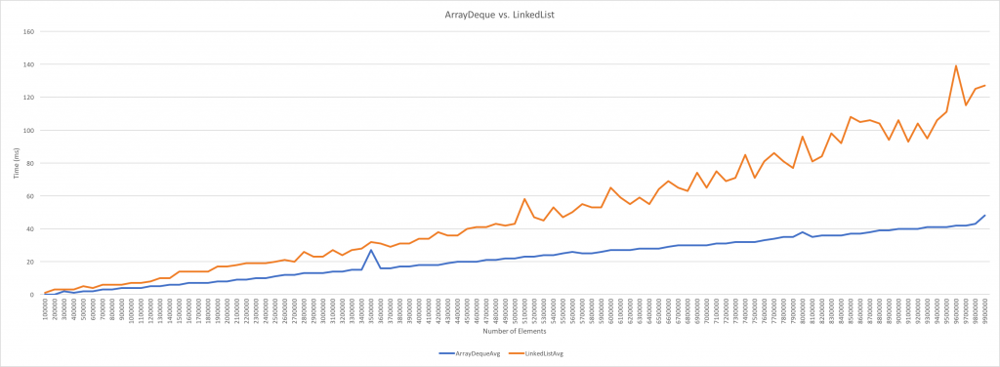

# Data Structure

## # Collection Framework

... working

## # ETC

#### Stack 과 Queue 를 만드는데 적합한 구현체 (ArrayDeque vs LinkedList)
- ArrayDeque 는 Java 6 에 추가된 기능입니다.
- 일반적으로 수정이 많은 경우 Array 보다 List 가 더 좋은 성능을 가지고 있다고 알려져있습니다.
    - 하지만 실제로는 ArrayDeque 가 더 좋은 성능을 가지고 있습니다.
- Array 의 크기를 재설정하거나 메모리상의 연속적인 객체의 검색에 드는 코스트가 List 에서의 Node 검색과 생성에서 생기는 코스트보다 적습니다.

|             | ArrayDeque      | LinkedList   |
| ----------- | --------------- | ------------ |
| Better Case | Except Remove() | Remove()     |
| Allow Null  | No              | Yes          |

- 참고 자료  
http://brianandstuff.com/2016/12/12/java-arraydeque-vs-linkedlist/  
https://stackoverflow.com/questions/6163166/why-is-arraydeque-better-than-linkedlist
