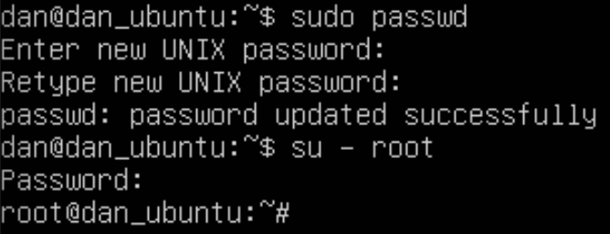

# 회원 가입

## Setting

### # 구성 자원

- Virtual Box 6.1  
- Ubuntu 18.04.4 LTS (Bionic Beaver) 64 Bit
- MySql 5.7
- 이하의 문서에서 local 은 `내 컴퓨터` 를 remote 는 `Virtual Box Ubuntu` 를 뜻합니다.

### # Ubuntu 설치하기

- Install Image Mount 후 실행시 자동으로 설치됩니다.


- remote 에서 root 비밀번호 설정  


### # ssh 접속하기

1. 포트 포워딩 설정
   - 설정 - 네트워크 - 어댑터1 - 고급 - 포트 포워딩
   

2. local 에서 netstat 명령어로 22222 port 의 listen 확인

```shell script
choibyunghyeon  ~/VirtualBox VMs
 netstat -an | grep 22222
tcp4       0      0  *.22222                *.*                    LISTEN
```

1. remote 에 ssh 설치 (이미 설치했다면 생략 가능)
   1. openssh 설치 여부 확인
      - `dpkg -l | grep openssh`

   2. openssh 설치

```shell script
sudo apt-get update
sudo apt-get install openssh-server
```

   3. openssh 설치 확인
        

   4. local 에서 ssh 접속하기

```shell script
 ssh dan@localhost -p 22222
dan@localhost's password:
Welcome to Ubuntu 18.04.3 LTS (GNU/Linux 4.15.0-91-generic x86_64)
...
dan@dan_ubuntu:~$
```

### # mysql 설치하기

1. mysql version 확인

```shell script
dan@dan_ubuntu:~$ sudo apt-cache search mysql-server
...
mysql-server-5.7 - MySQL database server binaries and system database setup
...
```

2. 설치

`sudo apt-get install mysql-server-5.7`

3. root 비밀번호 설정

> mysql 접속 방법이 기존 패스워드 방식에서 우분투 18.04 부터 auth_socket 플러그인을 이용하는 방식으로 변경되었습니다.
아래는 이를 패스워드 방식으로 변경하고 기본 비밀번호를 'root' 로 설정하는 스크립트입니다.

```
dan@dan_ubuntu:~$ sudo mysql
Welcome to the MySQL monitor.  Commands end with ; or \g.
Your MySQL connection id is 4
Server version: 5.7.29-0ubuntu0.18.04.1 (Ubuntu)

Copyright (c) 2000, 2020, Oracle and/or its affiliates. All rights reserved.

Oracle is a registered trademark of Oracle Corporation and/or its
affiliates. Other names may be trademarks of their respective
owners.

Type 'help;' or '\h' for help. Type '\c' to clear the current input statement.

mysql> update mysql.user set plugin='mysql_native_password' where user='root';
Query OK, 1 row affected (0.00 sec)
Rows matched: 1  Changed: 1  Warnings: 0

mysql> update mysql.user set authentication_string=PASSWORD('root') where user='root';
Query OK, 1 row affected, 1 warning (0.00 sec)
Rows matched: 1  Changed: 1  Warnings: 1

mysql> flush privileges;
Query OK, 0 rows affected (0.01 sec)

mysql> quit;
Bye
```

4. root 접속 확인

```shell script
dan@dan_ubuntu:~$ mysql -u root -p
Enter password:
...
mysql>
```

### # mysql 한글 설정하기

1. characterset 확인

```shell script
mysql> status
--------------
...
Server characterset:	latin1
Db     characterset:	latin1
Client characterset:	utf8
Conn.  characterset:	utf8
...
```

2. /etc/mysql/my.cnf 에 설정 추가

```shell script
[client]
default-character-set = utf8

[mysqld]
init_connect = SET collation_connection = utf8_general_ci
init_connect = SET NAMES utf8
character-set-server = utf8
collation-server = utf8_general_ci

[mysqldump]
default-character-set = utf8

[mysql]
default-character-set = utf8
```

3. characterset 확인

```shell script
mysql> status
--------------
...
Server characterset:	utf8
Db     characterset:	utf8
Client characterset:	utf8
Conn.  characterset:	utf8
...
```