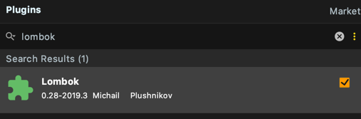
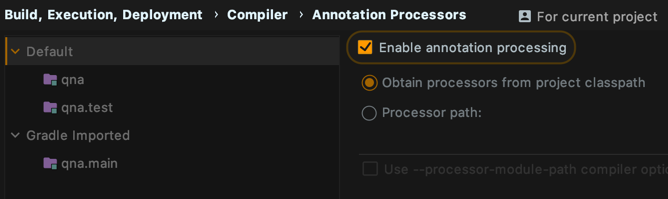

# Logging

## lombok + Slf4j

-  build.gradle
```properties
configurations {
    ...
    all {
        // log4j2 로깅 설정 : 중복되는 logging 제거
        exclude group: 'org.springframework.boot', module: 'spring-boot-starter-logging'
    }
    ...
}

dependencies {
    ...
    // log4j2 로깅 설정
    compile group: 'org.springframework.boot', name: 'spring-boot-starter-log4j2'

    // lombok 설정
    compile group: 'org.projectlombok', name: 'lombok', version: '1.18.8'
    annotationProcessor group: 'org.projectlombok', name: 'lombok', version: '1.18.8'
    ...
}
```

- lombok plugin 설치



- Annotation Processors `Enable`

File > Settings > Build, Execution, Deployment > Compiler > Annotation Processors


- lombok.config 를 통해 세부 설정이 가능합니다.

#### Test Code
```java
@Slf4j
@SpringBootApplication
public class QnaApplication {

	public static void main(String[] args) {
		SpringApplication.run(QnaApplication.class, args);
		log.info("Simple log statement with inputs {}, {} and {}", 1, 2, 3);
	}
}

2020-02-26 21:59:14 INFO  QnaApplication:13 - Simple log statement with inputs 1, 2 and 3
```
## 참고 자료
https://projectlombok.org/setup/gradle  
https://stackoverflow.com/questions/9424364/cant-compile-project-when-im-using-lombok-under-intellij-idea  
https://howtodoinjava.com/spring-boot2/logging/logging-with-lombok/
