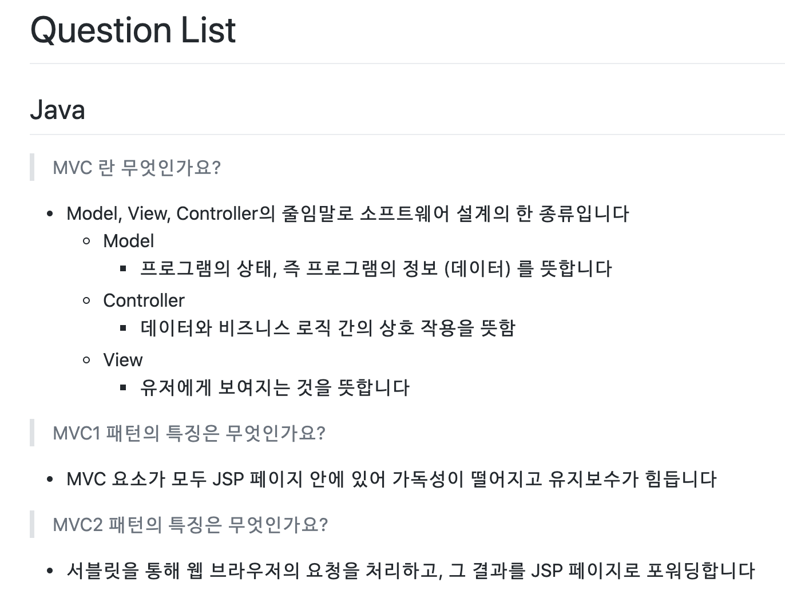

# Plan

## 왜 만들어야 하는가 ?

블로그와 깃허브들을 보면서 하나의 개념을 설명하기 위해 배경 지식과 이해하기 쉬운 그림이 필요하다는 것을 느꼇습니다  
하지만 어느정도의 이해를 쌓은 후 취업 면접을 준비하면서는 그 지식들이 짧고 간결한 문장이어야 겠다는 생각이 들었습니다  

그리고 반복 학습을 위해 `이런 질답이 문서 형태가 아닌 쉽게 접근할 수 있는 다른 형태면 어떨까?` 라는 생각을 하게 되었습니다

## 현재 상태는 어떠한가 ?

### # Repository 를 이용한 문서 형태

- 서술형의 문서입니다
- 카테고리화, 검색이 힘듭니다
- 반복 학습을 위한 접근성이 떨어집니다

## 어떻게 개선할 것인가 ?

### # DB 관리

- 질답의 추가, 삭제를 용이하게 합니다
- 카테고리화와 확장성을 대비할 수 있습니다

### # UX 개선

- 서술형이 아닌 하나의 질답, 특히 답변이 한눈에 들어올 수 있도록 길이를 제한합니다
- 최소한의 질답 형태를 스피드 게임과 같이 만들어 접근성을 향상 시킵니다

## 어떻게 보여줄 것인가 ?

- 질문과 블라인드된 답변이 카드의 형태로 나옵니다
- 사용자가 답변을 클릭하면 답변이 보입니다
- `다음` 버튼을 통해 랜덤한 질답 카드가 나올 수 있도록 합니다

## 어떤 기술을 사용할 것인가 ?

### # 프로젝트 관리

- Github Project - Issue 사용
- Swagger

### # Server

- Spring Boot
- heroku 를 통한 서버 배포

### # DB

- local
  - docker 를 통한 mysql
- remote
  - ? 를 통한 mysql

### # 제약조건

- 모바일에 특화된 환경이어야 합니다

## 추가 구현

- 카테고리 관리
  - BE, FE, iOS 등
- 좋아요, 싫어요
  - 랭킹 기능 연계
  - `싫어요` 가 많은 질답은 삭제
- 선택되지 않는 질답
  - User 선택에 의해 특정 질답은 선택이 되지 않습니다
  - User - Question 사이의 관계가 필요합니다
- User 에 의한 질답 추가
