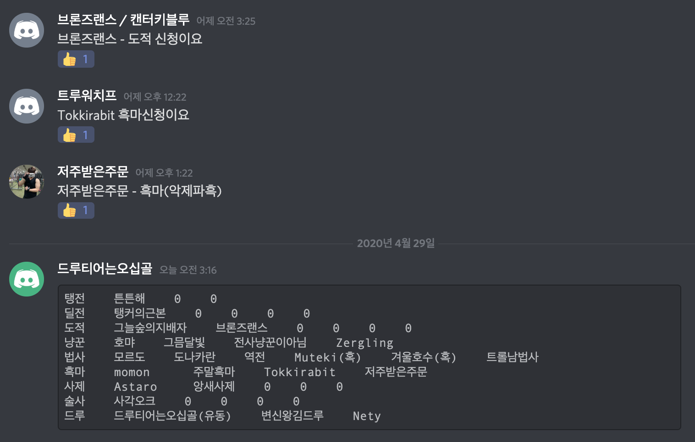
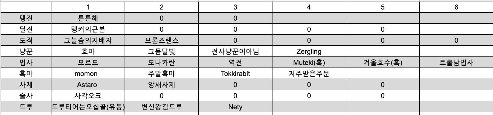
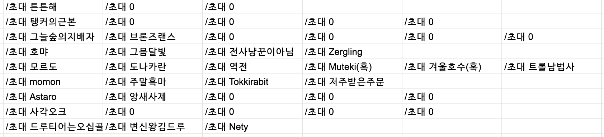

# Raider50G

> Repository

<https://github.com/Hyune-c/raider50g>

> WorkLog

- [Work Log #1](https://github.com/Hyune-c/TIL/blob/master/Toy%20Project/Raider50G/Wokr%20Log%20%231.md)
  - Discord API 테스트를 해본 기록입니다
- [Work Log #2](https://github.com/Hyune-c/TIL/blob/master/Toy%20Project/Raider50G/Wokr%20Log%20%232.md)
  - 부족한 기반 지식으로 기본 구조 및 테스트를 진행하면서 실패한 기록입니다

---

## 왜 만들어야 하는가 ?

저는 여가 생활 중 하나로 WOW Classic 를 즐기고 있습니다  
여러 가지 콘텐츠 중 공대장으로서 레이드를 제일 즐기고 있지만, 40명 +@ 에 달하는 인력과 일정 관리를 Discord 와 Google Spreadsheet 로 혼자 처리하고 있고 이 과정에서 누락의 위험성과 낮은 생산성의 작업이 반복되고 있습니다

이를 위해 본섭은 인 게임의 `달력`을 지원하지만, Classic 은 지원되지 않습니다

## 현재 상태는 어떠한가 ?

### # 인원 & 일정 관리

- Discord 채널을 통해 ID 와 직업을 예약받습니다
- Spreadsheet 에 기록합니다
- 누락 방지를 위해 기록된 내용을 채널에 게시합니다

### # 인 게임에서의 공대원 초대

`=if(B2="", "", "/초대 " &B2)`

- 접속 여부가 불분명한 40명의 인원을 반복적으로 확인하며 초대하고 있습니다
- 기록된 Spreadsheet 를 기반으로 초대 매크로를 만들어 사용하고 있습니다

## 어떻게 개선할 것인가 ?

> 아래의 과정을 모두 DB 로 저장합니다

### # 일정 관리

- 해당 일의 레이드 종료 후 새로운 예약 시작을 알리는 문구를 작성합니다
  - ex : `##### 4/26일 (일) PM 19:00 검둥 예약받습니다`

### # 인원 관리

- 키워드를 통해 직업을 분류하고 ID 를 기록합니다
  - ex : `술사스피카-복술`
  - 메타 데이터를 관리하여 유사한 키워드를 허용합니다
  - 해석할 수 없는 키워드가 입력될 경우 Bot 메세지를 통해 재입력을 유도합니다
  - 인증되지 않은 인원 (기 참여회수 2회 이하) 의 경우 `확정`이 아닌 `확인 필요`로 기록합니다
- 취소에 대한 키워드를 구현합니다
- 예약 인원에 변동이 생긴 경우 전체 리스트를 채널에 출력합니다

### # 초대 관리

- 예약 인원을 기준으로 초대 매크로를 생성하는 API 를 제공합니다

## 어떤 기술을 사용할 것인가 ?

### # 프로젝트 관리

- Github Project - Issue 를 통한 개발 항목과 우선순위 관리
- ReadMe.md 관리

### # Server

- DDD 에 따른 도메인 구조 관리
- Spring Boot
  - Discord API 사용
  - OAuth2 를 이용한 인증
  - Web MVC 를 이용한 API 제공
  - JPA, queryDSL 을 활용한 영속성 관리
- heroku 를 통한 내장 tomcat 배포
  - heroku 가 sleep 되지 않게 하기 위한 처리

### # DB

- mysql
  - ERD 작성과 정규화

### # 제약조건

- 민감 정보 보호
- 로깅 & 모니터링 방법 고려
