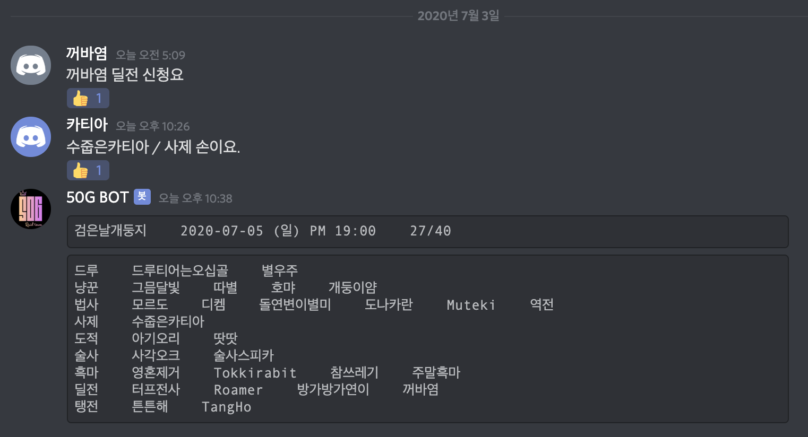
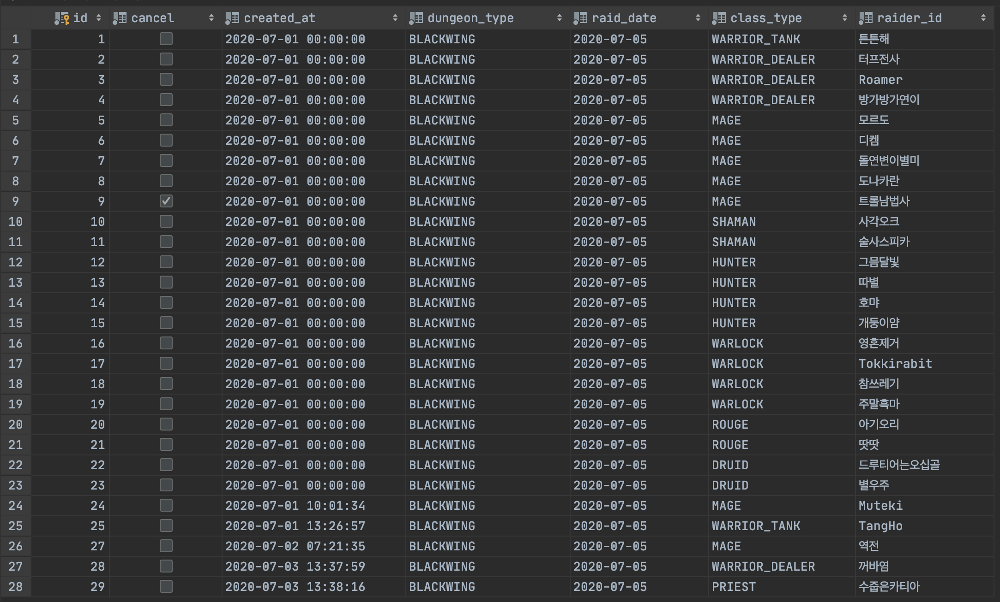

# Work Log #4

## 작업 내용

<https://github.com/Hyune-c/raider50g/pull/11>

- `예약 취소`, `공대원 초대 매크로 스크립트` 구현
- local Profile 에 대해 `H2 Server` 가 기동되도록 설정
- README 에 프로젝트 내용 정리

<https://github.com/Hyune-c/raider50g/pull/12>

- `RestTemplate` 에서 `WebClient` 의 사용으로 기술 전환
- 기능의 흐름이 좀 더 말이 되도록 리팩토링

## 다음 작업
  
- 채널의 메세지를 가져와서 조작하기

## 회고

`예약 취소` 와 `초대 매크로` 를 만들면서 드디어 사용 가능한 최소 목표를 달성했습니다!  
비록 자동화와 예외 처리가 부족하지만 프로그램을 통해 예약 관리를 시작했다는 것에 의의를 두고 있습니다

좀 더 나아가기 위해서는 `WebClient` 를 통해 채널 메세지를 조작할 수 있어야 하지만, 이 부분은 공부가 필요해 시간이 걸릴 것 같습니다  
일단 일주일 정도 돌려보면서 리팩토링과 문제점을 궁리해보겠습니다

- Bot 을 통해 게시된 예약 리스트

- MySQL 로 관리되는 예약 DB
